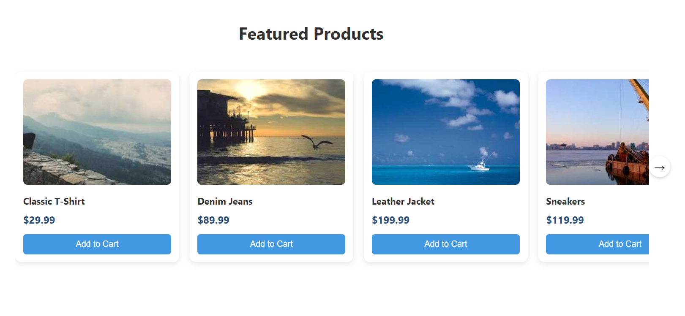

# 🛒 React Product Slider – LDW Studio

Slider orizzontale di prodotti in React, pensato per integrazione su Shopify o altri e-commerce.  
💡 Perfetto per freelance, dropshipper e business digitali che vogliono un **modulo moderno e fluido**.

👉 [](https://ldwstudio.github.io/demo-react-slider/) *(link demo se lo metti su GitHub Pages)*



---

## ✨ Caratteristiche

- ✅ Layout responsive con card eleganti
- ✅ Navigazione con frecce e supporto touch su mobile
- ✅ Animazioni fluide (scroll e hover)
- ✅ Compatibile con Shopify (embed o app custom)
- ✅ Pulito, leggero e riutilizzabile
- ✅ Design moderno con bordi arrotondati e shadow

---

## 📦 Tech Stack

[]()  
[]()  
[]()

---

## 🚀 Come Integrarlo in Shopify

1. **Builda il componente React** (`npm run build`)
2. Copia `index.js` e `style.css` nella tua pagina Shopify personalizzata
3. Inserisci questo nella pagina:
```html
<div id="product-slider"></div>
<script src="product-slider.js"></script>
<link rel="stylesheet" href="product-slider.css" />
